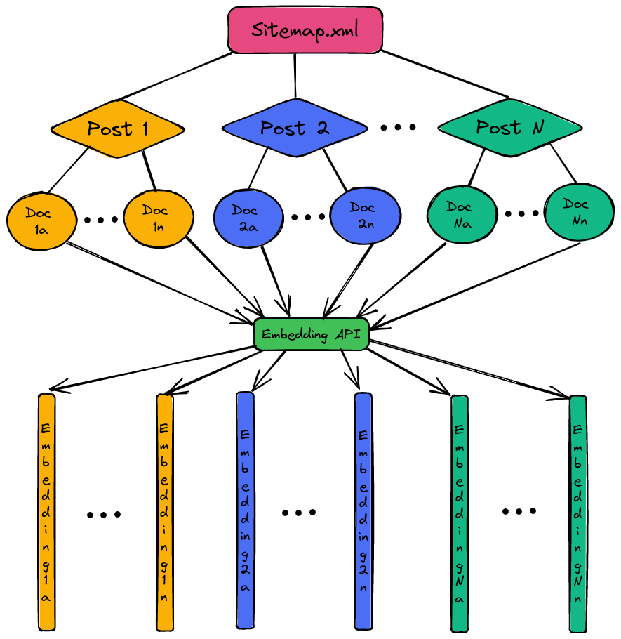
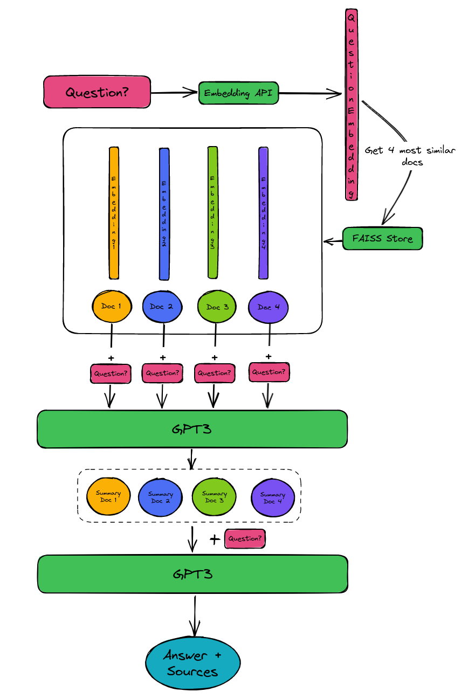

This repo reached the front page of hacker news on March 22nd 2023, see the discussion <a href="https://news.ycombinator.com/item?id=35252223" target="_blank">here</a>.

## Your website content -> chatbot / Q&A agent

Turn your website content into a question answering bot which can cite your document sources.

Alternatively, use it in an interactive chatbot style fashion.

All this can be achieved with a tool called <a href="https://github.com/hwchase17/langchain" target='_blank'>langchain</a> which in turn uses the OpenAI API.

This simple repository showcases how to apply it on your own website content.

To do so, there are three scripts:

* create_embeddings.py: this is the main script which loops your website's sitemap.xml to create embeddings (vectors representing the semantics of your data) of your content
* ask_question.py: after you have the embeddings (a file called `faiss_store.pkl` was created), this script can be used to directly ask a question. It will answer the question and return the URLs of your website which were used as the source.
* start_chat_app.py: starts a simple chat interface where you can ask a question and then follow-up on the answer. If the bot is uncertain, it will indicate so. Note that you can tune the query in this script to be more relevant for your content. In my case I mentioned it to be specific to machine learning and technical topics.

To install the dependencies, simply run `pip install -r requirements.txt`.

### Create your embeddings

This is the most important step and you will need to obtain an OpenAI API key to use it.

Once you have the `$api_key`, you can run `export OPENAI_API_KEY='$api_key'` in your terminal.

Then simply run `python create_embeddings.py --sitemap https://path/to/your/sitemap.xml --filter https://path/to/your/blog/posts`.

This will create your embeddings in a file called `faiss_store.pkl`. You need to point your website's sitemap.xml to the script and you can filter for URL's to start with filter. If you want to include all pages of your site, you can just set `--filter https://`.

For more details about this, please check <a href="https://www.paepper.com/blog/posts/build-q-and-a-bot-of-your-website-using-langchain/">this blog post</a>.

### Answering a question while getting the answer source documents

With the embeddings set up, ask a question like this: `python ask_question.py "How to detect objects in images?"`

    Answer:

    Object detection in images can be done using algorithms such as R-CNN, Fast R-CNN, and data augmentation techniques such as shifting, rotations, elastic deformations, and gray value variations.

    Sources:

    https://www.paepper.com/blog/posts/deep-learning-on-medical-images-with-u-net/
    https://www.paepper.com/blog/posts/end-to-end-object-detection-with-transformers/

### Starting a chatbot on your content

With the embeddings set up, start a chatbot like this: `python start_chat_app.py`. Then when it's running, ask your questions and follow-ups.
